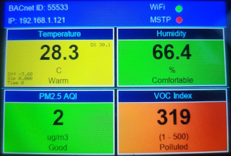
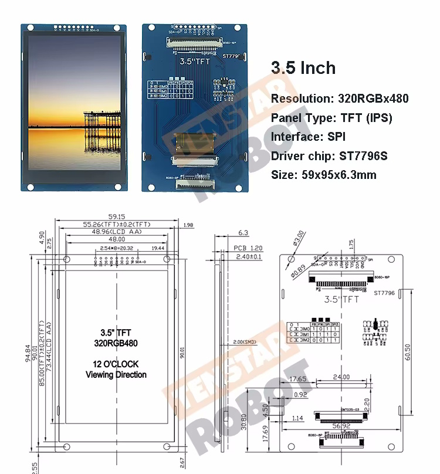

# Display Profiles

The project supports multiple display and UI implementations selected through ESP-IDF Menuconfig.

The ESP-IDF processor target and display profile are selected separately.

A profile may appear for either supported target, but its GPIO mapping must be electrically valid for the physical processor board.

---

## Selecting a profile

In Visual Studio Code:

1. Press `Ctrl+Shift+P`.
2. Run `ESP-IDF: SDK Configuration Editor`.
3. Open:

```text
Project hardware
└── Display profile
```

Available selections:

```text
ST7796S 480x320 3.5in - colorful UI
ST7796S 480x320 - test UI
ST7789 170x320 - HW657A - Simple UI
No display
```

After changing the profile, save Menuconfig and rebuild the project.

---

## Profile summary

| Kconfig symbol               | Display/UI              | UI source                                      |
| ---------------------------- | ----------------------- | ---------------------------------------------- |
| `USER_DISPLAY_ST7796S`       | ST7796S colorful UI     | `main/ui/profiles/display_st7796s_current.cpp` |
| `USER_DISPLAY_ST7796S_TEST`  | ST7796S test UI         | `main/ui/profiles/display_st7796s_test.cpp`    |
| `USER_DISPLAY_ST7789_HW657A` | HW657A ST7789 simple UI | `main/ui/profiles/display_st7789_hw657a.cpp`   |
| `USER_DISPLAY_NONE`          | No physical display     | `main/ui/profiles/display_none.c`              |

The generated compile-time symbols use the `CONFIG_` prefix:

```c
CONFIG_USER_DISPLAY_ST7796S
CONFIG_USER_DISPLAY_ST7796S_TEST
CONFIG_USER_DISPLAY_ST7789_HW657A
CONFIG_USER_DISPLAY_NONE
```

---

# 1. ST7796S colorful UI

## Menuconfig selection

```text
ST7796S 480x320 3.5in - colorful UI
```

## Kconfig symbol

```c
CONFIG_USER_DISPLAY_ST7796S
```

## UI source

```text
main/ui/profiles/display_st7796s_current.cpp
```

The source filename retains `_current` for compatibility with the current CMake configuration. The Kconfig symbol itself no longer uses `_CURRENT`.

## TFT_eSPI setup

```text
components/TFT_eSPI/User_Setups/Setup_Project_ST7796S.h
```

## Display

* Controller: ST7796S
* Native panel dimensions: 320 × 480
* Application orientation: 480 × 320 landscape
* Interface: SPI
* SPI frequency: 26 MHz
* Touch controller: not configured

## TFT wiring

| Signal    |     GPIO |
| --------- | -------: |
| MOSI      |       10 |
| SCLK      |        9 |
| MISO      | Not used |
| CS        |       13 |
| DC        |       12 |
| RST       |       11 |
| Backlight |       14 |

## UI features

The colorful UI currently includes:

* BACnet Device instance
* IP address
* Wi-Fi status
* BACnet MS/TP status
* SEN54 temperature
* SEN54 relative humidity
* PM2.5
* VOC index
* DS18B20 comparison temperature
* SEN54 temperature-compensation values
* Color-coded environmental categories

## Sensor defaults

Selecting this profile currently also sets:

| Setting   |   Value |
| --------- | ------: |
| SEN54 SDA |   GPIO4 |
| SEN54 SCL |   GPIO5 |
| DS18B20   | Enabled |

## Images

### UI



### Display



---

# 2. ST7796S test UI

## Menuconfig selection

```text
ST7796S 480x320 - test UI
```

## Kconfig symbol

```c
CONFIG_USER_DISPLAY_ST7796S_TEST
```

## UI source

```text
main/ui/profiles/display_st7796s_test.cpp
```

## TFT_eSPI setup

```text
components/TFT_eSPI/User_Setups/Setup_Project_ST7796S.h
```

This profile uses the same ST7796S controller, resolution, TFT configuration, and GPIO wiring as the colorful ST7796S profile.

It compiles a separate UI implementation so display experiments can be made without changing the main colorful UI.

## TFT wiring

| Signal    |     GPIO |
| --------- | -------: |
| MOSI      |       10 |
| SCLK      |        9 |
| MISO      | Not used |
| CS        |       13 |
| DC        |       12 |
| RST       |       11 |
| Backlight |       14 |

## Sensor defaults

Selecting this profile currently also sets:

| Setting   |   Value |
| --------- | ------: |
| SEN54 SDA |   GPIO4 |
| SEN54 SCL |   GPIO5 |
| DS18B20   | Enabled |

---

# 3. ST7789 HW657A simple UI

## Menuconfig selection

```text
ST7789 170x320 - HW657A - Simple UI
```

## Kconfig symbol

```c
CONFIG_USER_DISPLAY_ST7789_HW657A
```

## UI source

```text
main/ui/profiles/display_st7789_hw657a.cpp
```

## TFT_eSPI setup

```text
components/TFT_eSPI/User_Setups/Setup_Project_ST7789_HW657A.h
```

## Hardware

This profile is intended for the ESP32-WROOM-32 development board with an integrated portrait ST7789 display commonly identified as HW657A.

## Display

* Controller: ST7789
* Native dimensions: 170 × 320
* Interface: SPI
* SPI frequency: 20 MHz
* Color order: BGR
* Display inversion: enabled
* Touch controller: not configured

## TFT wiring

| Signal    |     GPIO |
| --------- | -------: |
| MOSI      |       23 |
| SCLK      |       18 |
| MISO      | Not used |
| CS        |       15 |
| DC        |        2 |
| RST       |        4 |
| Backlight |       32 |

## Sensor defaults

Selecting this profile currently also sets:

| Setting   |    Value |
| --------- | -------: |
| SEN54 SDA |   GPIO13 |
| SEN54 SCL |   GPIO14 |
| DS18B20   | Disabled |

## Image


---

# 4. No display

## Menuconfig selection

```text
No display
```

## Kconfig symbol

```c
CONFIG_USER_DISPLAY_NONE
```

## UI source

```text
main/ui/profiles/display_none.c
```

This implementation provides no-operation versions of the common display API:

```c
display_init()
display_update_values()
display_set_link_status()
```

The BACnet, sensor, persistence, and optional Adafruit IO services can therefore run without a physical display.

## Sensor defaults

Selecting this profile currently sets:

| Setting   |    Value |
| --------- | -------: |
| SEN54 SDA |    GPIO4 |
| SEN54 SCL |    GPIO5 |
| DS18B20   | Disabled |

## Current TFT_eSPI build behavior

TFT_eSPI remains an unconditional component dependency in the current project.

For that reason, `components/TFT_eSPI/User_Setup.h` includes a valid ST7796S setup when `CONFIG_USER_DISPLAY_NONE` is selected, allowing TFT_eSPI to compile.

The no-display implementation does not initialize or access the physical TFT.

---

# How profile selection works

Profile selection is performed in three stages.

## 1. Kconfig

The choices are defined in:

```text
main/Kconfig.projbuild
```

Only one choice may be active.

## 2. UI source selection

`main/CMakeLists.txt` adds the corresponding UI implementation to `APP_SRCS`.

Example:

```cmake
if(CONFIG_USER_DISPLAY_ST7796S)
    list(APPEND APP_SRCS
        "ui/profiles/display_st7796s_current.cpp"
    )
endif()
```

## 3. TFT hardware selection

TFT_eSPI includes:

```text
components/TFT_eSPI/User_Setup.h
```

That file selects one of:

```text
User_Setups/Setup_Project_ST7796S.h
User_Setups/Setup_Project_ST7789_HW657A.h
```

The normal and test ST7796S UI profiles share the same TFT hardware setup.

---

# Processor target and display profile

The processor target is selected separately through:

```text
ESP-IDF: Set Espressif Device Target
```

Supported targets:

```text
esp32
esp32s3
```

The display choices are not hidden according to processor target.

This makes it possible to reuse a display implementation with another supported processor, provided that:

* The display controller is compatible.
* The GPIO mapping is valid.
* The selected pins do not conflict with flash, PSRAM, USB, UART, I²C, or other peripherals.
* The TFT is wired according to the selected setup file.

Selecting a profile does not automatically prove that its GPIO mapping is safe for the selected processor board.

---

# Current coupling with sensor defaults

Although the menu choices are named display profiles, the current Kconfig also derives sensor settings from the selected display.

The current relationships are:

```text
ST7796S profiles:
    SEN54 SDA = GPIO4
    SEN54 SCL = GPIO5
    DS18B20 enabled

HW657A profile:
    SEN54 SDA = GPIO13
    SEN54 SCL = GPIO14
    DS18B20 disabled

No display:
    SEN54 SDA = GPIO4
    SEN54 SCL = GPIO5
    DS18B20 disabled
```

The relevant generated settings are:

```c
CONFIG_USER_SEN54_SDA_GPIO
CONFIG_USER_SEN54_SCL_GPIO
CONFIG_USER_SENSOR_DS18B20
```

Consequently, the current profiles select the display/UI and also provide sensor-related build defaults.

---

# Common display API

Every profile implements the interface declared in:

```text
main/ui/display.h
```

The common API includes:

```c
void display_init(void);

void display_update_values(
    float pm25,
    float temperature,
    float humidity,
    float voc,
    float temp_ds18b20);

void display_set_link_status(
    bool wifi_connected,
    bool mstp_connected);
```

Application modules call this common interface without needing to know which profile was compiled.

---

# Adding another display profile

To add a new profile:

1. Add a new option to the `USER_DISPLAY_PROFILE` choice in:

```text
main/Kconfig.projbuild
```

2. Create the UI implementation under:

```text
main/ui/profiles/
```

3. Add the source-selection condition to:

```text
main/CMakeLists.txt
```

4. Create a TFT_eSPI setup file under:

```text
components/TFT_eSPI/User_Setups/
```

5. Add the corresponding selection to:

```text
components/TFT_eSPI/User_Setup.h
```

6. Implement the complete common display API.

7. Document the controller, resolution, orientation, SPI frequency, and GPIO mapping in this file.

8. Build and test the new profile on the intended physical hardware.
