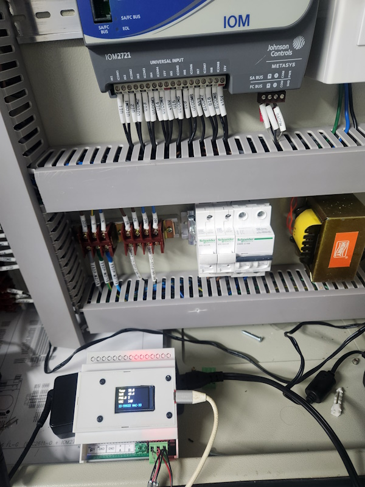
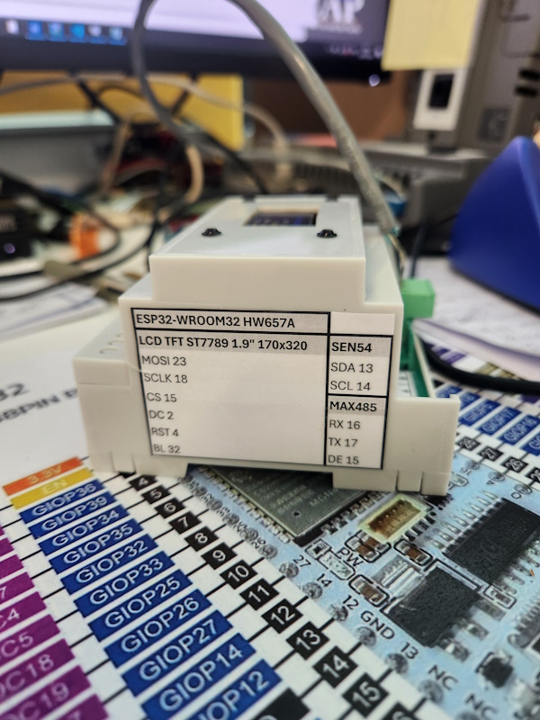

# ESP32 BACnet Air Quality Controller

Configurable ESP32/ESP32-S3 BACnet device for Sensirion SEN54 air-quality monitoring, optional DS18B20 temperature sensing, local display, BACnet/IP, BACnet MS/TP, and optional Adafruit IO publishing.

The project supports selectable hardware/display profiles while keeping BACnet identity, transport settings, object mappings, defaults, and persistence configuration centralized in `main/User_Settings.c`.

The device has been tested on a large Metasys ADX production site using:

* SNE MS/TP bus;
* BACRouter-S MS/TP-to-Ethernet router;
* BACnet/IP over Wi-Fi through a Vonets VAP11G-300 Wi-Fi repeater/bridge.

## Features

* BACnet/IP over Wi-Fi
* BACnet MS/TP over RS485
* BACnet Change of Value (`COV`)
* SEN54 temperature, humidity, VOC, and particulate measurements
* SEN54 configuration, maintenance commands, and diagnostic status
* Optional DS18B20 temperature measurement and calibration offset
* Selectable ESP32 and ESP32-S3 hardware/display profiles
* TFT_eSPI and LVGL display implementations
* Optional CST816 capacitive touch support
* NVS persistence for writable BACnet properties
* Full BACnet Device identity
* Optional Adafruit IO MQTT publishing
* Startup settings report and FreeRTOS stack monitoring
* Private credentials excluded from source control

## Target and Display Selection

Select the ESP-IDF target separately from the hardware/display profile:

```text
ESP-IDF: Set Espressif Device Target
ESP-IDF: SDK Configuration Editor
Project hardware
└── Display profile
```

See [`docs/profiles/`](docs/profiles/) for supported profiles, wiring, sensor defaults, and profile-specific notes.

After changing the target, display profile, TFT controller, or GPIO mapping, run a full clean build.

## BACnet Object Model

The default configuration exposes 36 BACnet objects:

| Objects    | Default purpose                                                 |
| ---------- | --------------------------------------------------------------- |
| `AI1–AI7`  | SEN54 temperature, RH, VOC, PM1.0, PM2.5, PM4.0, and PM10       |
| `AI8`      | DS18B20 temperature                                             |
| `AV1`      | SEN54 automatic fan-cleaning interval                           |
| `AV2–AV4`  | SEN54 temperature compensation offset, slope, and time constant |
| `AV5`      | DS18B20 temperature offset                                      |
| `AV6–AV16` | Available general Analog Values                                 |
| `BV1`      | SEN54 full reset                                                |
| `BV2`      | SEN54 measurement enable                                        |
| `BV3`      | Start SEN54 fan cleaning                                        |
| `BV4`      | Clear SEN54 status                                              |
| `BI1–BI4`  | Fan, laser, VOC, and RHT sensor faults                          |
| `BO1–BO4`  | Available general Binary Outputs                                          |

These are logical default roles. BACnet instance numbers, names, descriptions, units, initial values, COV increments, and binary text are configurable through the parallel arrays in `main/User_Settings.c`.

## Configuration

### Public settings

Edit:

```text
main/User_Settings.c
main/User_Settings.h
```

These files contain:

* BACnet Device identity and instance;
* BACnet/IP and MS/TP enable flags;
* static IP and BBMD settings;
* MS/TP MAC address, baud rate, Max Master, and Max Info Frames;
* BACnet object instances and metadata;
* Adafruit IO enable flag and feed key;
* NVS default-restoration policy.

### Private credentials

Copy:

```text
main/User_Private_Settings.example.h
```

to:

```text
main/User_Private_Settings.h
```

Then enter the Wi-Fi and, when required, Adafruit IO credentials. The private file is ignored by Git.

## Build

Tested environment:

* ESP-IDF `5.5.4`
* Arduino-ESP32 `3.3.11`
* Visual Studio Code with the ESP-IDF extension
* Git

The supplied PowerShell wrapper verifies the ESP-IDF installation before running `idf.py`:

```powershell
powershell -NoProfile -ExecutionPolicy Bypass `
    -File .\tools\build_idf55.ps1 build
```

After changing a display profile or TFT_eSPI setup:

```powershell
powershell -NoProfile -ExecutionPolicy Bypass `
    -File .\tools\build_idf55.ps1 fullclean

powershell -NoProfile -ExecutionPolicy Bypass `
    -File .\tools\build_idf55.ps1 build
```

Flash and monitor using the ESP-IDF extension or the corresponding wrapper arguments.

See [`SETUP.md`](SETUP.md) for the complete environment, configuration, build, and flashing procedure.

## Persistence

Supported BACnet object properties and sensor configuration values are stored in NVS.

Normal operation:

```c
USER_OVERRIDE_NVS_ON_FLASH = 0;
```

To erase saved values and restore compiled defaults on the next boot:

```c
USER_OVERRIDE_NVS_ON_FLASH = 1;
```

After restoring the defaults, return the setting to `0`; otherwise NVS will be erased at every startup.

## Documentation

* [`SETUP.md`](SETUP.md) — environment, configuration, build, and flashing
* [`docs/profiles/`](docs/profiles/) — supported hardware/display profiles and wiring
* [`docs/DISPLAY_HARDWARE_PROFILES_GUIDE.md`](docs/DISPLAY_HARDWARE_PROFILES_GUIDE.md) — adding and maintaining profiles
* [`OBJECTS_CONFIGURATION.md`](OBJECTS_CONFIGURATION.md) — BACnet object configuration and NVS persistence

The legacy [`Profiles.md`](Profiles.md) file redirects to the profile documentation folder.

## Source Layout

```text
main/
├── app/                 Application services and sensor coordination
│   └── sensors/         SEN54 and optional DS18B20 services
├── bacnet/              BACnet runtime, coordinator, event bus, and objects
│   └── objects/         AI, AV, BI, BV, and BO implementations
├── platform/            Wi-Fi and MS/TP RS485 interfaces
├── ui/
│   ├── hardware/        Profile-specific touch/display support
│   └── profiles/        Selectable display/UI implementations
├── User_Settings.c      Device and BACnet configuration
├── User_Settings.h      Object counts and logical role definitions
└── main.c               Application startup
```

## Screenshots

### Production installation



### ESP32 BACnet hardware



### BACnet objects in YABE


